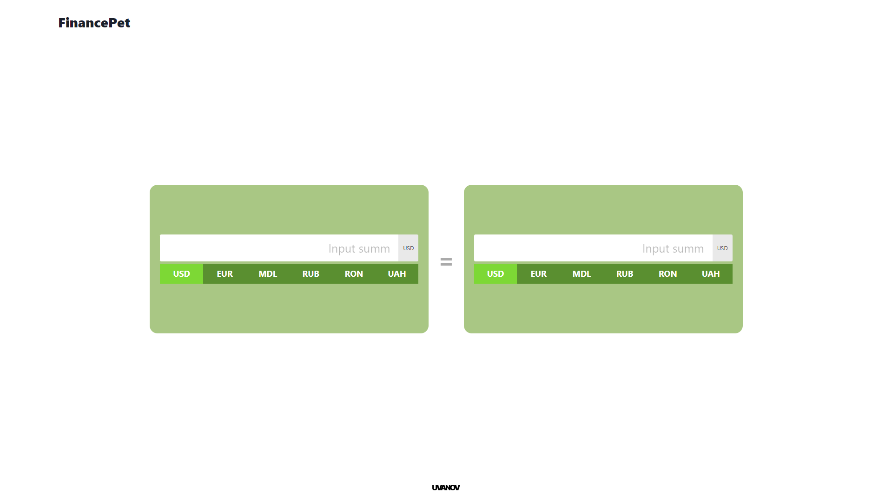

<h2 
  style="margin-top: 40px"
  align="center"
>
  Wallet Converter
</h2>

  Small pet-project, where i tried to build currency-converting tool. 

 

Used technologies:
<ul>
  <li>
    React.js
  </li>
  <li>
    ChakraUI
  </li>
  <li>
    @emotion
  </li>
</ul>

 
<strong>Demo: </strong> <a href="https://wallet-converter.netlify.app">link</a>